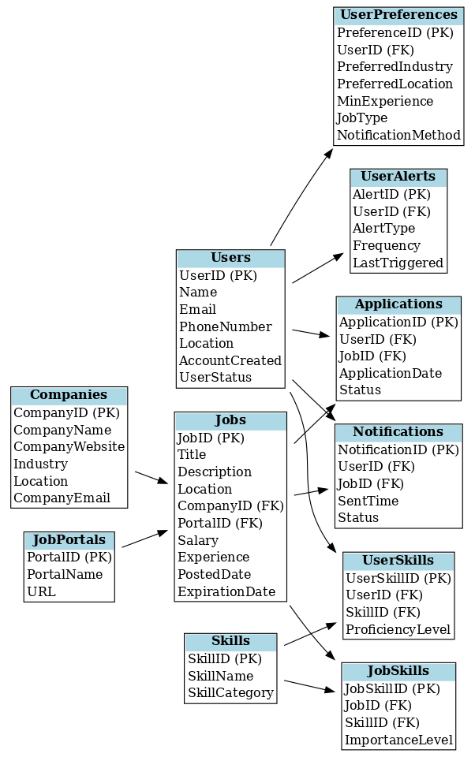

# 💼 JobNexus Pro

**JobNexus Pro** is a smart and scalable job notification and tracking system that connects users to job opportunities based on their skills, preferences, and real-time job listings from multiple platforms. This project includes a well-structured relational database, a detailed ERD, and SQL scripts to manage users, jobs, skills, notifications, and application workflows.

---

## 📌 Project Highlights

- Matches users with job postings based on preferences and skills
- Stores user preferences, job listings, applications, and notifications
- Supports multiple job portals and companies
- Includes automated notification tracking and job alerts

---

## 🧱 ERD Overview

A detailed Entity-Relationship Diagram (ERD) is provided to visualize the database schema.

  

> The ERD illustrates core entities like `Users`, `Jobs`, `Companies`, `Applications`, and their relationships.

---

## 🗂️ Folder Structure
📁 JobNexus_Pro/
├── README.md                     # Full project overview: setup, features, usage, queries

├── Database/                     # All DDL and DML scripts
│   ├── JobNexus_Pro.sql          # Full database schema (DDL)
│   └── insert_data.sql           # Sample data inserts (DML)

├── Queries/                      # SQL queries for analytics and insights
│   └── analytics_queries.sql     # 10+ advanced SQL queries (JOINs, aggregations, recommendations)

├── Documents/                         # Documentation for database and system architecture
│   ├── Database_Description.md   # Table-wise explanation with keys and relationships
│   └── project_architecture.md   # Text-based explanation of data flow and system logic

├── Diagrams/                     # ERDs and visual schema diagrams
│   ├── ERD.png                   # Basic Entity-Relationship Diagram
│   └── Detailed_ERD.png          # Detailed schema layout (high-res)

├── Results/                      # Sample outputs from query execution
│   ├── Sample_Results.sql        # Result-oriented SQL queries
│   └── Results.pdf               # Query outputs, visualizations, or screenshots (PDF format)

---

## ⚙️ How to Use

1. **Set up the database:**

   - Use a MySQL-compatible client (e.g., MySQL Workbench, DBeaver, or CLI).
   - Run the `JobNexus.sql` script to create the schema and tables.

2. **(Optional) Insert sample data**  
   *(Provide a script if needed)*

3. **Explore the schema:**

   - Use queries to explore job matches, user applications, and notifications.

---

## 🔧 Technologies Used

- MySQL / MariaDB
- SQL DDL & DML
- Database Design Principles
- ER Modeling

---

## 🚀 Future Enhancements

- Front-end dashboard for users and admins
- API integration with job portals (e.g., LinkedIn, Indeed)
- Email/SMS-based job alert automation
- Advanced filtering and recommendation engine

---

## ❓ Do You Want the Code?

> The database schema is just the starting point!  
If you'd like a working backend, frontend, or automation logic for JobNexus Pro (e.g., Python, Flask, Node.js, or Power BI dashboard), feel free to [raise an issue](#) or fork the project and reach out.

---

## 🧑‍💻 Author

**Akash Divvela**
[LinkedIn](https://www.linkedin.com/in/akash-divvela/) | [Email](mailto:divvelaakash@gmail.com)

---

